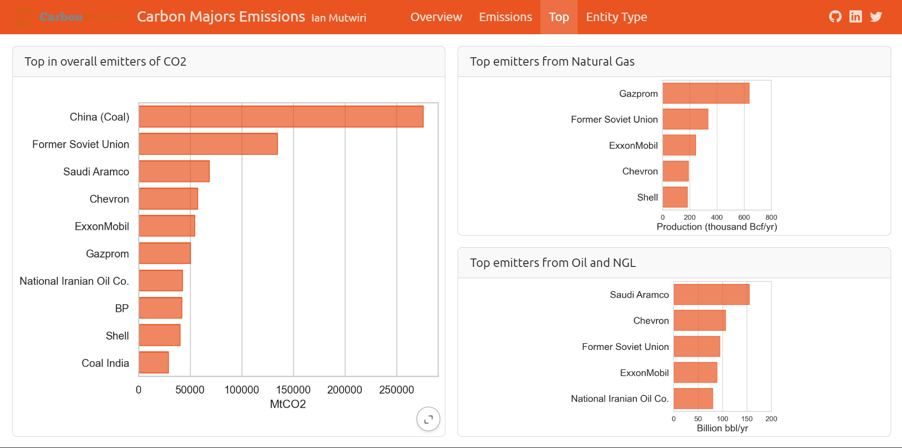

As part of its efforts to ensure accouintability of industrial corporations that emit
CO<sub>2</sub>, [The Carbon Majors](https://carbonmajors.org/) research group started 
compiling their production data since 2013. The data spans back to 1854 but here I have
used data from 1900

The data can be used to quantify the degree of the environmental destruction caused by these entities.
In this project I use the data as uploaded in the [#TidyTuesday](https://x.com/hashtag/TidyTuesday?src=hashtag_click) challenge to create 
a Quarto dashboard that tracks the levels of production over time, breaks it down by entity and highlight the leading producers

To run the project in your browser follow along these steps
# Install the Quarto CLI.
The installation instructions are available at [here](https://quarto.org/docs/get-started/)
# Create and activate a virtual environment
In your working directory initialize a virtual environment using [uv](https://github.com/astral-sh/uv)
```
pip install uv

uv venv

On macOS and Linux.
source .venv/bin/activate

On Windows.
.venv\Scripts\activate
```
# Install the project dependencies
```
uv pip sync -o requirements.txt
```
# Run
Open the terminal and run the following code to view the live dashboard in the browser
```
quarto preview d:/DS/Python/quarto_dashboard/emissions.qmd --no-browser --no-watch-inputs
```
# Sample



